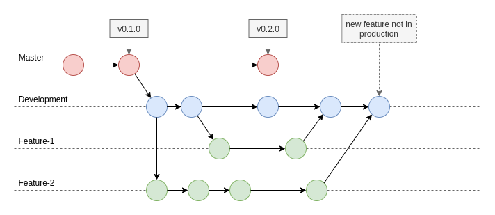
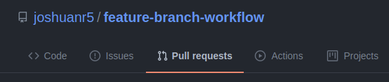
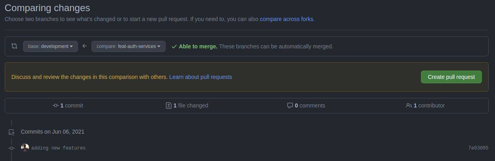

# Configurando tu flujo de trabajo con Git

## Introducción

Hoy en día Git se ha vuelto una herramienta básica para trabajar cuando estas desarrollando un proyecto, sea de manera individual o con un equipo.

Esto se debe porque brinda una serie de herramientas que hacen la vida mas facil a los programadores, permite la colaboración en equipo, detecta conflictos y mantiene un historial de todos los cambios que se realicen en el proyecto, a todo esto se le llama **control de versiones** siendo Git la mas popular hoy en dia (si quieres saber mas sobre el control de versiones puedes visitar este [enlace](https://www.atlassian.com/es/git/tutorials/what-is-version-control)).

Git ofrece gran flexibilidad a la hora de trabajar, esto es positivo ya que te permite adaptar su funcionamiento a tu flujo de trabajo y no te impone uno. Aunque por este mismo motivo, cuando uno inicia un proyecto y no tiene experiencia puede llegar a ser un poco confuso saber cual es la mejor forma de trabajar. Es por eso que decidí hacer este blog, en la cual comentaré una de las distintas soluciones que puedes encontrar.

## Features Branches Workflow (FBW)
El *flujo de trabajo de ramas de funcionalidades* nos brinda el concepto de ramas de funcionalides (*feature branch* en ingles), la cual consiste en no trabajar directamente en la rama principal, sino crear una rama la cual este dedicada a una funcionalidad en especifico, de ahi su nombre. Esto nos brinda un espacio de trabajo por funcionalidades en las  cuales uno o mas personas puedan estar trabajando en un mismo funcionamiento sin alterar la rama principal o el trabajo de otras funcionalidades ajenas.

Una vez que se tenga la funcionalidad lista, esta se podria integrar con la rama principal por medio de un **pull request** brindando una capa de seguridad extra a la rama principal ya que con este método se puede tener control de los cambios que se estan insertando.

## Uso de la rama de desarrollo (development)

Aunque bien en el flujo de trabajo de ramas de funcionalidades se hace uso de la rama `master` por defecto, muchos equipos ven necesario tener una rama secundaria la cual es conocida como la rama `developmente` o `dev`, esta rama seria una copia de la rama `master` y tendria las funcionalidades que aun no han sido desplegadaz a producción. Esto da a enteder que todo commit hecho en la rama `master` seria reflejado en el usuario final (producción), mientras que los cambios hechos en la rama `development` no necesariamente tendrían impacto con el usuario final.



## Ejemplos

### Inicialización del proyecto

---
*Nota: En este ejemplo se usará como servicio de alojamiento de repositorio GitHub y el ejemplo sera para crear un boilerplate para ExpressJS.*

---

Lo primero que se debería hacer es crear la carpeta del proyecto con su estructura inicial (mejor conocido como *boilerplate*). Tambien iniciaremos Git para el proyecto creado (no se olviden  de tener un .gitignore en la estructura de su proyecto).

```sh
# Creamos el proyecto con su estrctura inicial
❯ npx create-nodejs-express-app feature-branch-workflow
❯ cd feature-branch-workflow

# Inicializamos Git
❯ git init -b development
Initialized empty Git repository in <your-path-folder>/.git/
```

En el ultimo comando usamos la opción de `-b <branch-name>` para indicar cual sera la rama principal, en una inicio de proyecto es natural iniciar con la rama `development` ya que en producción aun no se ha desarrollado nada, ya cuando se realice el primer despliegue, se creara la rama master.

Lo siguiente es crear un repositorio remoto donde se almacenaran nuestro proyecto, una vez creado llego el momento de realizar el primer commit y push.

```sh
❯ git add .
❯ git commit -m "initial commit"
# Agregamos nuestro repositorio remoto
❯ git remote add origin <your-repository-uri>
❯ git push -u origin development
Branch 'development' set up to track remote branch 'development' from 'origin'.
```

Una vez llegado a este punto, nuestro proyecto ya esta listo poder crecer en funcionalidades, esto se haria creando una rama `feature` teniendo como base  la rama `development`. Esto lo veremos en el siguiente ejemplo.

### Agregando funcionalidades al proyecto

Para agregar una funcionalidad se crearía una rama nueva, la cual tenga el nombre de la funcionalidad que se quiera trabajar, en lo personal me gusta llamarlo de la siguiente forma `feat-<feature-name>` esto puede variar segun el gusto, el objetivo es que se entienda la funcionalidad que se va a realizar en esa nueva rama. Tener en cuenta que esta rama siempre debe crearse a partir de la rama `development` y no de la rama `master`.


```sh
❯ git checkout -b feat-auth-services development
Switched to a new branch 'feat-auth-services'
```

Noten que el utimo parametro del comando siempre debería ser `development`.

En caso que estes trabajando solo o en equipo el desarrollo de la funcionalidad, es recomandable enlazar tu nueva rama con tu repositorio remoto, esto se hace haciendo un push al repositorio usando la opción de `--set-upstream` que también se conoce como `-u`.

```sh
❯ git push -u origin feat-auth-services
Branch 'feat-auth-services' set up to track remote branch 'feat-auth-services' from 'origin'.
```

Esto creara tu rama en el repositorio remoto y a la vez permitira rastrear los cambios que se hagan en esta rama (para mayor información pueder leer en siguiente [blog](https://devconnected.com/how-to-set-upstream-branch-on-git/)). Gracias a esto cuando quieras publicar nuevos cambios a tu rama `feature` lo podras hacer simplemente con el comando `git push`.

Una vez realizado todos los commits necesarios y la funcionalidad ya este probada, se daria inicio al **pull request**. Esto depende mucho de la plataforma que esten usando para almacenar su proyecto, en mi caso he usado [GitHub](https://github.com/), pero la experiencia es la misma en otras plataformas.

Lo primero sera ir a la opcion de Pull Request de tu repositorio.



Una vez ahi, le dan en `New pull request`


Esto les mostrara una pantalla donde les permitira elegir la `base` la cual es la fuente donde se insertara la nuava funcionalidad (elegir `development`), y el `compare` que seria la rama `feature` donde se hicieron y probaron los cambios.



Lo siguiente es darle en `Create pull request`, agregar una descrición y listo. Ahora el código nuevo que has escrito podra ser revisado y aprobado.

Como dije anteriormente, esto brinda una capa de seguridad extra al momento de realizar una integración.

## Conclusiones

Existen muchos flujos de trabajo para Git como [Gitflow Workflow](https://www.atlassian.com/git/tutorials/comparing-workflows/gitflow-workflow), [Forking Workflow](https://www.atlassian.com/git/tutorials/comparing-workflows/forking-workflow), etc. El objetivo de este blog es brindar una guía inicial de como desarrollar un flujo de trabajo en base al Feature Branch Workflow, por medio de ejemplos; ya que me vi con la necesidad de cuando quize enfrentar nuevos proyectos desde cero.

## Recursos
- [What is version control?](https://www.atlassian.com/git/tutorials/what-is-version-control)
- [Comparing Workflows](https://www.atlassian.com//git/tutorials/comparing-workflows)
- [Git Feature Branch Workflow](https://www.atlassian.com/git/tutorials/comparing-workflows/feature-branch-workflow)
- [How To Set Upstream Branch on Git](https://devconnected.com/how-to-set-upstream-branch-on-git/)